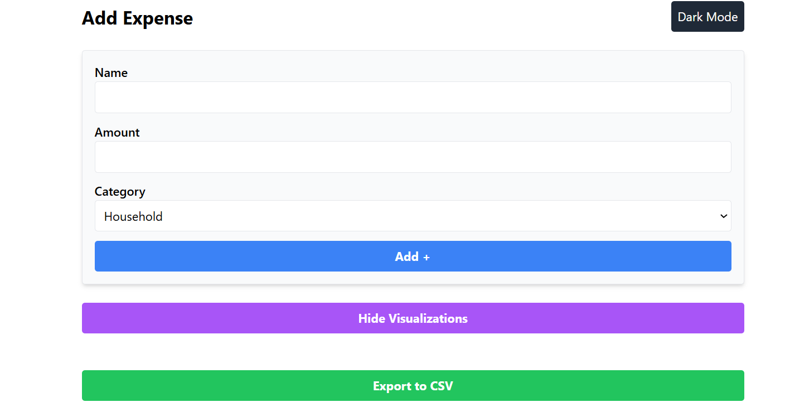
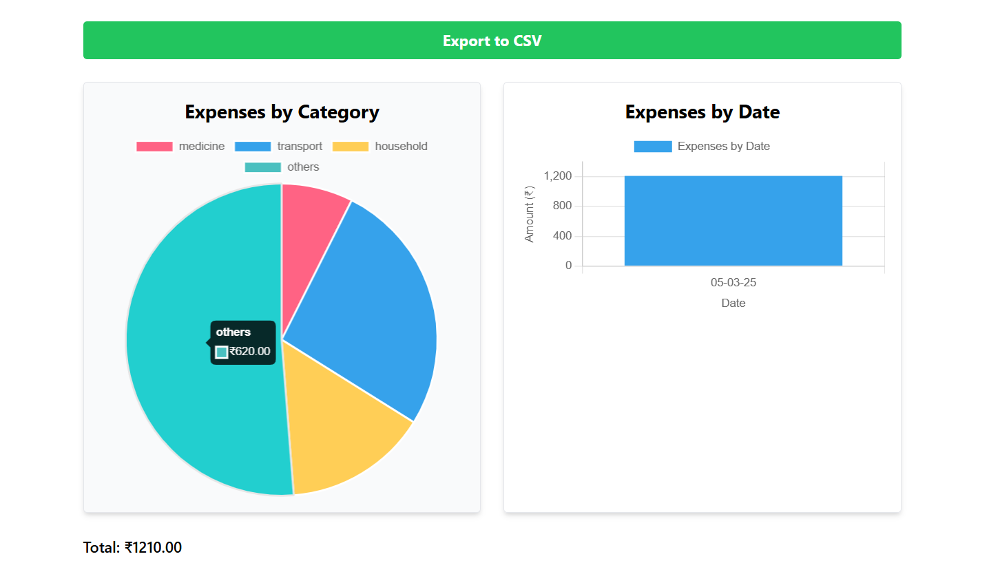

# Expense Tracker

A feature-rich web application to track, manage, and visualize your daily expenses with ease.

## Description
The Expense Tracker app helps users log their expenses, categorize them, and analyze spending patterns through interactive charts. Built with React and modern tools, it offers a responsive UI, dark mode support, and data export capabilities.

## Features
- **Add, Edit, Delete Expenses**: Record expenses with name, amount, category, and date.
- **Categories**: Choose from Household, Medicine, Transport, or Others.
- **Filtering & Sorting**: Filter by category, search by name, and sort by date or amount.
- **Visualizations**: View expenses by category (Pie Chart) and date (Bar Chart) using Chart.js.
- **Dark Mode**: Toggle between light and dark themes.
- **Local Storage**: Persist expenses across sessions.
- **CSV Export**: Download expenses as a `.csv` file.
- **Responsive Design**: Works seamlessly on desktop and mobile.

## Standout Features
- **Interactive Charts**: Visualize spending with Pie and Bar charts powered by Chart.js.
- **CSV Export**: Download your expenses for offline analysis.

## Screenshots
Here’s a look at the Expense Tracker app in action:

- **Main Interface**: Add and manage expenses.
  
- **Visualizations**: Pie and Bar charts of spending.
  

## Installation
To run the Expense Tracker locally, follow these steps:

1. **Clone the repository**:
   ```bash
   git clone https://github.com/abhishek-gupta-1977/expense-tracker.git
   cd expense-tracker

2. **Install dependencies**:
    npm install

3. **Run the app**:
    npm run dev


Open your browser and navigate to http://localhost:5173 (or the port shown in the terminal).


Technologies Used
React: For building the dynamic user interface.
Vite: For fast development and optimized builds.
Tailwind CSS: For responsive and modern styling.
Chart.js & react-chartjs-2: For Pie and Bar chart visualizations.
JavaScript (ES6+): Core programming language.
Local Storage: For persisting expense data.
Node.js: Runtime environment.


Usage
Add an Expense: Enter a name, amount, and category, then click "Add +".
Edit/Delete: Use the buttons next to each expense to modify or remove it.
Filter & Search: Use the dropdowns and search bar to refine the expense list.
Visualize: Click "Show Visualizations" to see Pie and Bar charts of your spending.
Export: Click "Export to CSV" to download your expenses.
Toggle Theme: Switch between light and dark mode with the button at the top.


Contributing
Contributions are welcome! Feel free to fork the repo, make improvements, and submit a pull request. Report bugs or suggest features via issues.

License
This project is licensed under the MIT License.

Contact
For questions or feedback, reach out to Abhishek Gupta.

